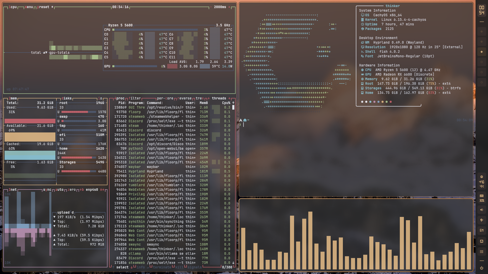
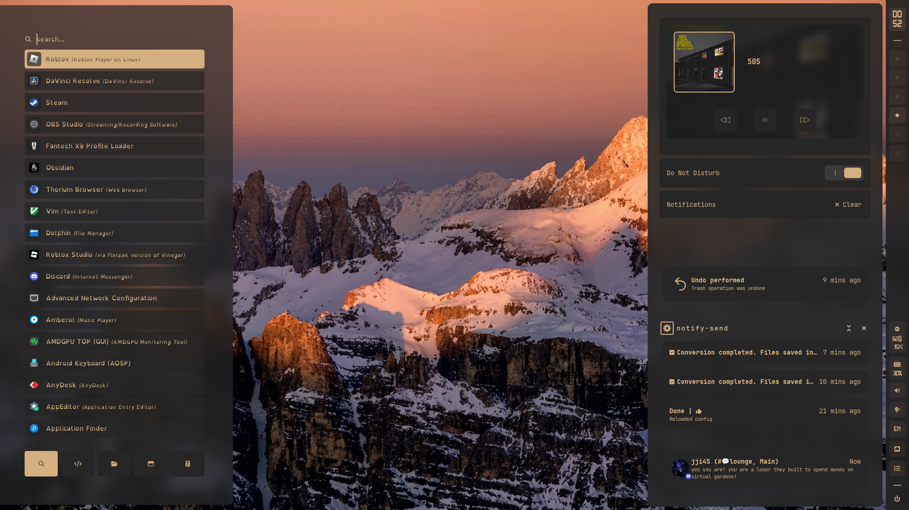
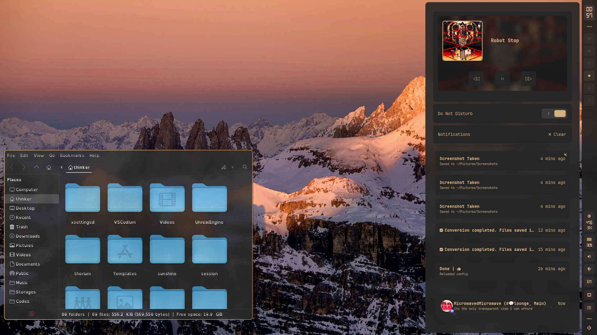

# SUDOER1337's Dotfiles

This is my personal dotfiles setup !

The bar is based on [gdots](https://github.com/niksingh710/gdots)
and alot of ohter peoples project that i regret cant remember

## 󰋩 Screenshots

### 🔶 My Hyprland Desktop





-  [Hyprland](https://github.com/hyprwm/Hyprland)
-  Waybar
-  Kitty
-  Swaync
-  Btop
-  Rofi


These are configured for my daily use on **CachyOS + Hyprland**
something here are kinda specfic , like i have autostart for my custom mouse driver so remove if you doenst need it

Feel free to borrow, fork or anything!  
 ⭐ if you find something useful

##  Install

```bash
cd ~/mydot
chmod +x ./Scripts/install.sh
./Scripts/install.sh 
``````
## 󰆓 Backup

To update:

```bash
cd /mnt/Storages/mydot
git add .
git commit -m "Update: $(date '+%Y-%m-%d %H:%M:%S')"
git push --force
