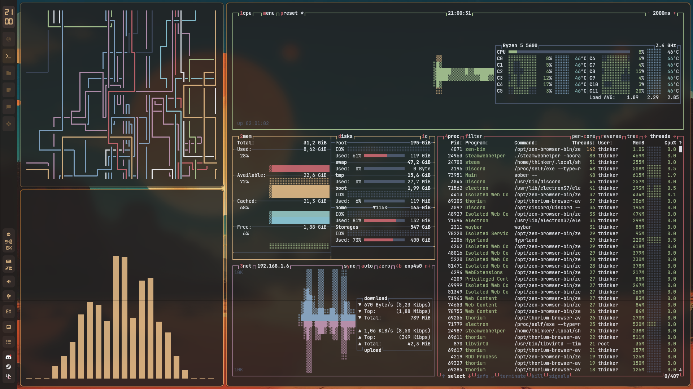
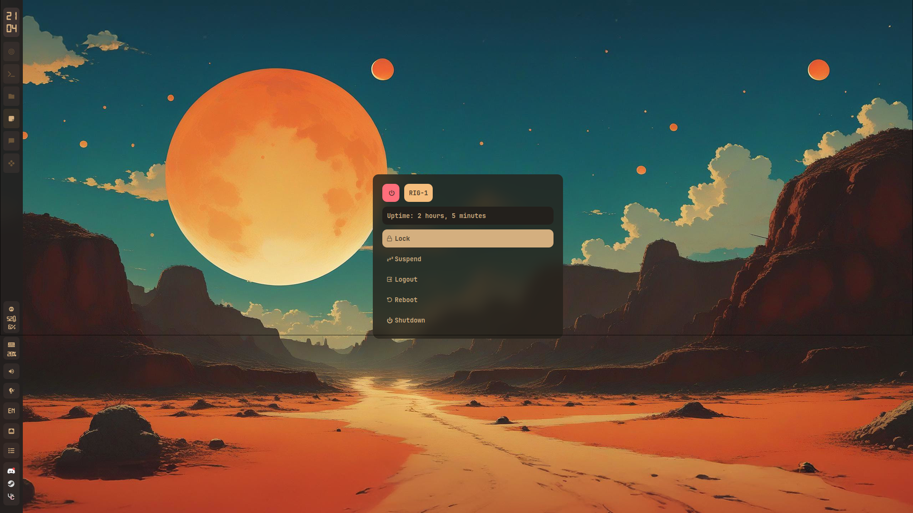

# SUDOER1337's Dotfiles

This is my personal dotfiles setup !

The Waybar is based on [gdots](https://github.com/niksingh710/gdots)
and alot of ohter people dotfiles that i regret cant remember

## 󰋩 Gallery

###  Hyprland Desktop

  

---

###  Rofi & Menus

#### Launcher
Just a launcher


#### Powermenu
Centered shutdown/reboot/logout prompt.  


#### Utilities
Calculator and emoji picker 
  


---

#### Waybar and Swaync
  


-  [Hyprland](https://github.com/hyprwm/Hyprland)
-  Waybar
-  Kitty
-  Swappy
-  Swaync (Downgrade to 11)
-  Btop
-  Rofi

Cursor: Bibata-Modern-Classic 24


These are configured for my daily use on **CachyOS + Hyprland**
something here are kinda specfic , like i have autostart for my custom mouse driver so remove if you doenst need it

Feel free to borrow, fork or anything!  
 ⭐ if you find something useful

##    Install
```bash
paru -S hyprland swww waybar-git rofi-wayland rofi-bluetooth-git rofi-wifi-menu-git aurutils hyprpaper hyprlock hypridle hyprsunset hyprpolkitagent archlinux-xdg-menu
```

```bash
git clone https://github.com/SUDOER1337/mydot.git ~/.mydot
cd ~/.mydot
chmod +x ./Scripts/install.sh
./Scripts/install.sh 
``````
## 󰆓   Backup

To update:

```bash
cd /mnt/Storages/mydot
git add .
git commit -m "Update: $(date '+%Y-%m-%d %H:%M:%S')"
git push --force
