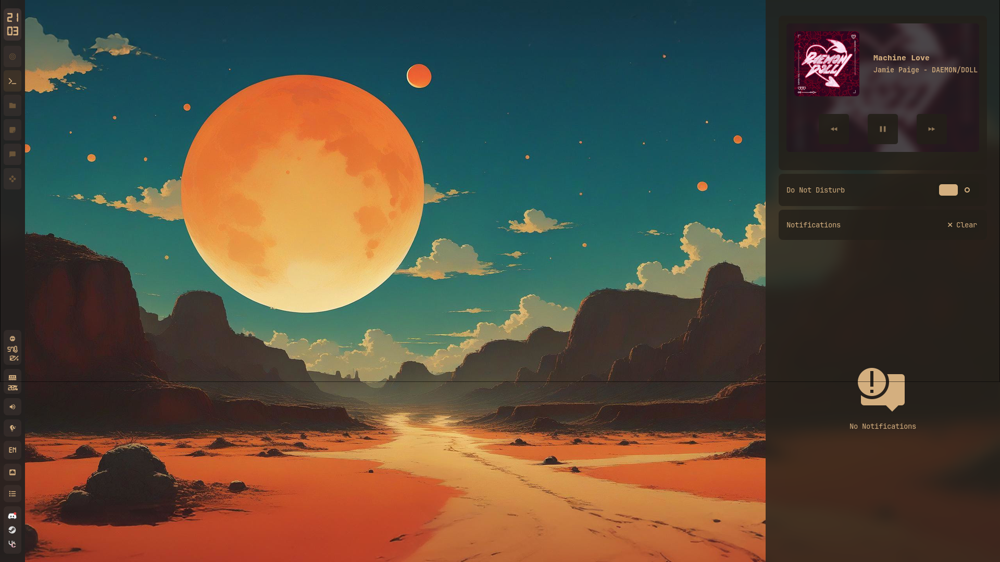

# SUDOER1337's Dotfiles

This is my personal dotfiles setup !

The Waybar is based on [gdots](https://github.com/niksingh710/gdots)
and alot of ohter people dotfiles that i regret cant remember

## 󰋩 Gallery

A quick look at how my setup feels in action.  
*(click to view images in full resolution)*

### 🖥️ Hyprland Desktop
Idle workspace with a clean Waybar and pastel tones.  


###  Terminals
Kitty running with my chosen theme and powerlevel10k prompt.  


###  App Launcher
Rofi-Wayland menu styled to match the color scheme.  


###  Notifications
Swaync (pinned to v11 for stability) with a minimal look.  


###  Utilities
- Calculator styled to blend with the desktop.  
  
- Nerdy emoji picker for quick reactions.  


###  Waybar
Lightweight, tidy status bar based on [gdots](https://github.com/niksingh710/gdots).  


### ⏻ Powermenu
Simple, centered shutdown/reboot/logout prompt.  


-  [Hyprland](https://github.com/hyprwm/Hyprland)
-  Waybar
-  Kitty
-  Swappy
-  Swaync (Downgrade to 11)
-  Btop
-  Rofi

Cursor: Bibata-Modern-Classic 24


These are configured for my daily use on **CachyOS + Hyprland**
something here are kinda specfic , like i have autostart for my custom mouse driver so remove if you doenst need it

Feel free to borrow, fork or anything!  
 ⭐ if you find something useful

##    Install

```bash
git clone https://github.com/SUDOER1337/mydot.git ~/.mydot
cd ~/.mydot
chmod +x ./Scripts/install.sh
./Scripts/install.sh 
``````
## 󰆓   Backup

To update:

```bash
cd /mnt/Storages/mydot
git add .
git commit -m "Update: $(date '+%Y-%m-%d %H:%M:%S')"
git push --force
